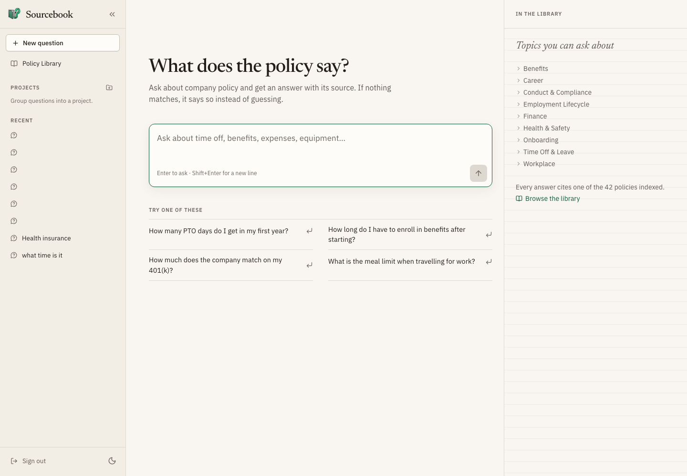
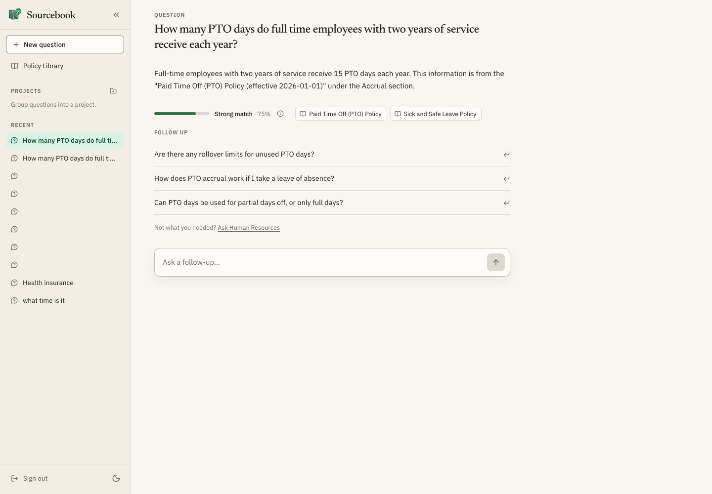
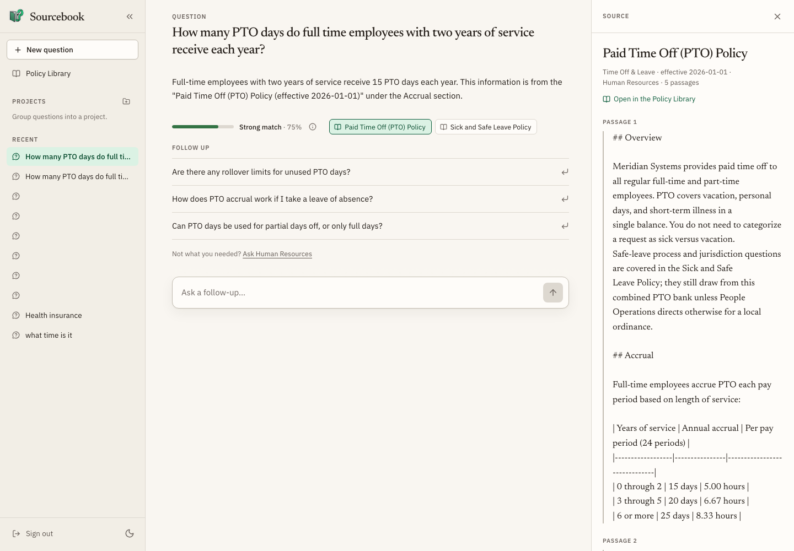
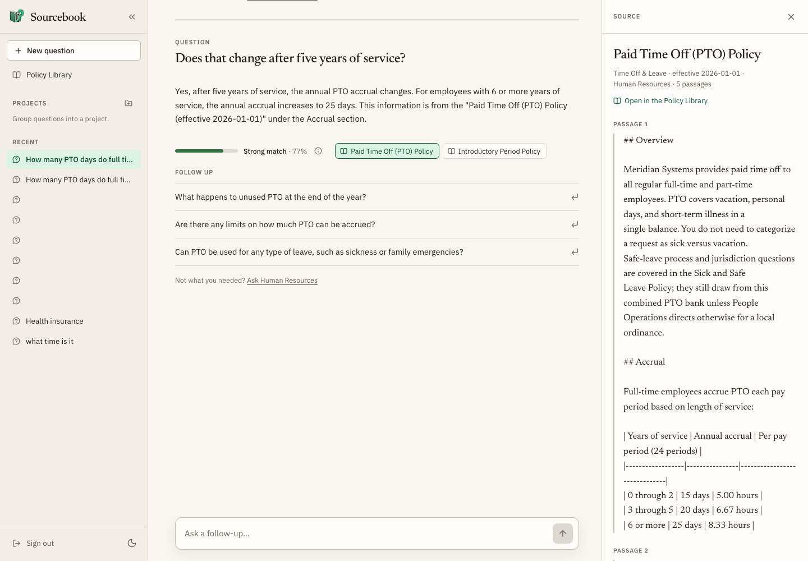
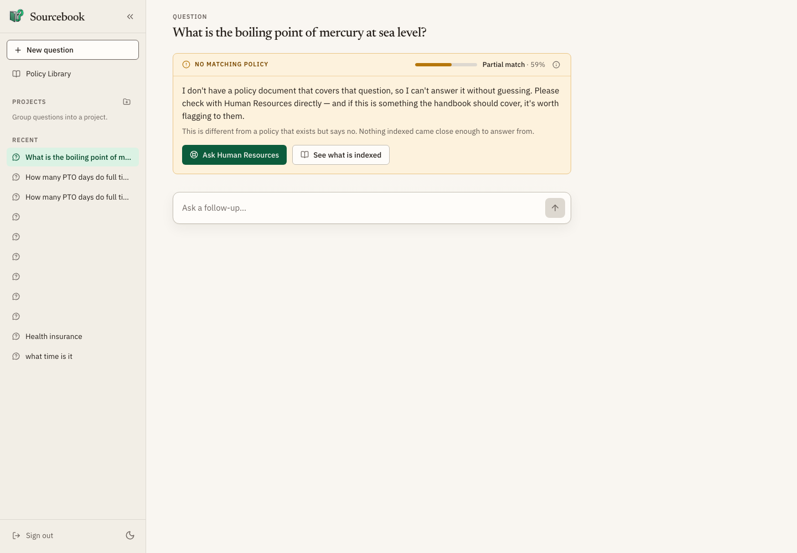
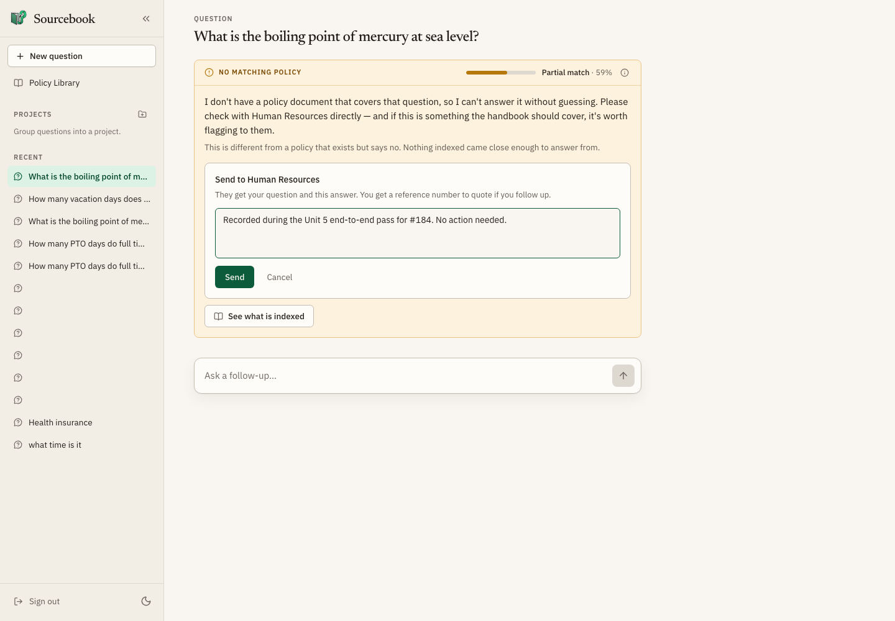
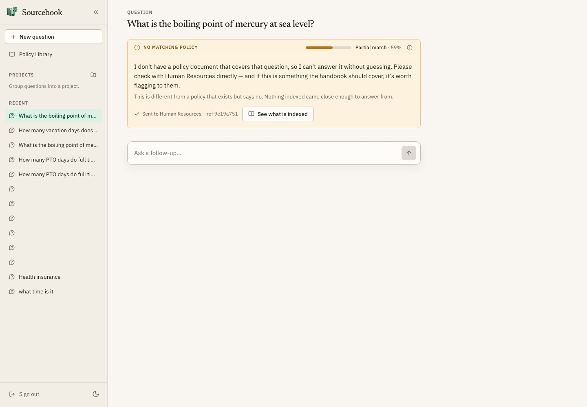

# User guide

How to use Sourcebook as an employee, and how Human Resources handles a
question that the corpus could not answer. This page documents the workflows
that ship on `main` today. Machine-readable route shapes are in
[api.md](api.md). Setup is in [install.md](install.md).

Screenshots below that show the browser come from the Unit 5 alpha evidence
set under [releases/v0.1.0-alpha.1/evidence/](releases/v0.1.0-alpha.1/evidence/).
They are interim. The portfolio cut expects a beta browser pass under
`docs/releases/v0.2.0-beta.1/evidence/` once that release folder exists; each
section that still waits on beta names a **screenshot placeholder**.

Human Resources works escalations from the **HR Requests** page in the app
([#159](https://github.com/CMSC495-GROUP3/Sourcebook/issues/159), shipped in
[pull request #250](https://github.com/CMSC495-GROUP3/Sourcebook/pull/250)).
The same operations are API routes, with an optional webhook, for a script or
a chat channel.

## For employees

Pilot: <https://sourcebook.duckdns.org>. Local stub: `make stub` then
`make web`, sign in with password `dev` (see [install.md](install.md)).

### Sign in

Sourcebook uses a shared password, not per-employee accounts. Open the site,
enter the password the team gave you, and submit. A wrong password shows
"Incorrect password." Too many attempts in a minute are rate-limited. A
successful sign-in stores a bearer token in the browser and opens chat.



> **Screenshot placeholder (beta).** Replace with
> `docs/releases/v0.2.0-beta.1/evidence/01-sign-in.png` after the beta browser
> pass. Wrong-password rejection is also captured in the alpha set as
> `01-wrong-password.png`.

### Ask a question

On **Chat**, type a plain-language policy question and send it. The app streams
the reply. History lives on the server: the client sends the question and a
`session_id`, never a chat-history array. Prior turns in that conversation are
what the model may use for follow-ups.



> **Screenshot placeholder (beta).**
> `docs/releases/v0.2.0-beta.1/evidence/02-ask-question.png`

### Citations and the match score

Every answered turn shows:

- **Source chips** — the policy document titles the answer drew from.
- A **match** badge — Strong / Partial / Weak with a percentage.

The percentage is the mean similarity of the retrieved passages to the
question. It measures how well the indexed text fits the question, **not**
whether the prose answer is correct. Open the info control on the badge for
that wording in the UI. Treat a weak or partial match as a reason to open the
source and read it yourself.

### Open a cited source

Click a source chip. On a wide layout the **Source** pane docks beside the
answer and shows the indexed passages used for that citation. A link in the
pane opens the same document in the **Policy Library** as the full rendered
markdown. Close or collapse the pane when you are done.



> **Screenshot placeholder (beta).**
> `docs/releases/v0.2.0-beta.1/evidence/03-open-source.png`

You can also open **Policy Library** from the sidebar: search or filter by
category, then read a document in full.

### Follow-ups

Under the latest answer, suggested follow-up buttons may appear. Choosing one
sends that text as the next question in the same conversation. You can also
type your own follow-up in the composer. Reloading the page restores the
thread from the server when you reopen that conversation from the sidebar.



> **Screenshot placeholder (beta).**
> `docs/releases/v0.2.0-beta.1/evidence/04-follow-up.png`

### Refusals

When nothing indexed matches closely enough, Sourcebook **refuses** rather
than guessing. The card is labeled **No matching policy**. That is different
from a policy that exists and says no: the corpus did not support an answer
from retrieval. The card still shows the match meter for the best attempt, a
prominent **Ask Human Resources** control, and a link to see what is indexed.



> **Screenshot placeholder (beta).**
> `docs/releases/v0.2.0-beta.1/evidence/05-refusal.png`

Stub tip: `make stub REFUSE=1` forces the refusal path so you can practice
escalation without a thin corpus.

### Escalate to Human Resources

Use escalation when the assistant refused, or when an answer did not help
(**Not what you needed? Ask Human Resources** under an answered turn).

1. Open the form. Optionally add a short note (context for HR).
2. Send. The server copies the question and answer from the stored
   conversation; the browser does not invent the exchange.
3. Confirmation shows **Sent to Human Resources** with a short reference
   (`ref` plus the first eight characters of the escalation id). Quote that
   reference if you follow up with HR by another channel.

Escalating the same turn twice returns the first record; you do not create
two tickets from a double click.





> **Screenshot placeholder (beta).**
> `docs/releases/v0.2.0-beta.1/evidence/06-escalate.png` and
> `07-escalate-confirmed.png`

After you escalate, wait for a person. There is no employee-facing status
page for open tickets on `main`.

### Other screens in the app

| Screen | How you reach it | What it is for |
| --- | --- | --- |
| Chat | sidebar **Chat**, or `/chat` | ask, read answers, escalate |
| Policy Library | sidebar **Policy Library**, or `/documents` | browse and read indexed policies |
| Conversations | sidebar list | reopen a prior `session_id` |
| Projects | sidebar (when used) | group conversations; optional |
| HR Requests | sidebar **HR Requests**, or `/escalations` | work the escalation queue; see below |

> **Screenshot placeholder (beta).** Policy Library list/reader:
> `docs/releases/v0.2.0-beta.1/evidence/08-policy-library.png`

## For Human Resources handlers

Employee escalations are stored in MongoDB. Handlers work them from the
**HR Requests** page. Delivery to a chat channel is optional, and every
operation on the page is also an API route.

### The HR Requests page

Open **HR Requests** from the sidebar. The **Open** tab lists requests newest
first, and **Resolved** lists closed ones. The count beside the title is the
full number for the tab, even past the first 50 shown.

Pick a request to see the question, the assistant's answer, the employee's
note, the reason (`refused` or `unhelpful`), the match score, the sources, and
webhook delivery.

- **Resolve:** write what you told the employee in **Resolution note** and
  choose **Resolve request**. It moves to the Resolved tab with the note.
- **Reopen:** open a resolved request and choose **Reopen request**.
- **Retry delivery:** shown when the webhook send failed and the server allows
  another attempt. If it fails again, the page says so. Past the attempt
  limit, the server's reason appears instead.

> **Screenshot placeholder (beta).** HR Requests with a request open:
> `docs/releases/v0.2.0-beta.1/evidence/09-hr-requests.png`

### Where escalations arrive

**1. Webhook channel (optional).** If `ESCALATION_WEBHOOK_URL` is set on the
API host, each new escalation is POSTed in the background after create. The
JSON body includes a Slack/Teams-friendly top-level `text` summary and the
full `escalation` object. Create never waits on the webhook. Delivery status
on the record is `pending`, `delivered`, or `failed`. If no webhook is
configured, nothing is sent: the request still reaches HR Requests and the
API, and its delivery status does not mean a send is queued. See
`.env.example` and [api.md](api.md).

**2. Open queue endpoint.** Authenticate with the same shared password
(`POST /api/auth/login`), then:

```http
GET /api/escalations?status=open
Authorization: Bearer <access_token>
```

Newest first. Optional `session_id` and `limit` (1–200, default 50). Each item
includes `escalation_id`, `reason` (`refused` or `unhelpful`), `question`,
`answer_excerpt`, `note`, `sources`, `confidence`, and delivery fields.
`GET /api/escalations/{escalation_id}` returns one record.


### Resolve through the API

```http
PATCH /api/escalations/{escalation_id}
Authorization: Bearer <access_token>
Content-Type: application/json

{"status": "resolved", "resolution": "Pointed them at the PTO carry-over section."}
```

`resolution` is optional text for what you told the employee. The record
gains `resolved_at`. List resolved items with `?status=resolved` when you need
history.

### Retry delivery through the API

If delivery failed and a webhook is configured:

```http
POST /api/escalations/{escalation_id}/retry-delivery
Authorization: Bearer <access_token>
```

Without a webhook configured, the API responds that webhook delivery is not
configured and does not invent a send.

### Knowledge-gap report

Every chat request writes one `query_logs` row (scores, refused, sources,
latency). The weekly-style human-readable report is an **offline CLI** over
that collection (shipped via pull request #171 / issue #160), not an HTTP
route and not a page in the web app.

On a host that can reach Atlas with `MONGODB_URI` loaded (typically the
deployed API host):

```bash
python -m sourcebook.rag.query_log_reports --since 2026-08-01
```

`--until` defaults to now (UTC). The report prints:

1. Top refused question-hash groups (content gaps — documents to write next)
2. Top repeated question hashes (FAQ candidates)
3. Answered vs refused score counts and a fixed histogram

Rows expire after the configured query-log TTL (90 days by default), so an
old window can print empty. Details and flags: module docstring in
`sourcebook/rag/query_log_reports.py`.

> **Screenshot placeholder (beta).** Terminal output of a real window on the
> pilot host:
> `docs/releases/v0.2.0-beta.1/evidence/10-knowledge-gap-report.png`

## Related pages

| Page | Covers |
| --- | --- |
| [install.md](install.md) | stub, real services, deploy |
| [api.md](api.md) | full escalation and chat contracts |
| [evaluation.md](evaluation.md) | labeled questions and live scoring |
| [releases/v0.1.0-alpha.1/handoff.md](releases/v0.1.0-alpha.1/handoff.md) | alpha scope and evidence map |
| [README Known limitations](../README.md#known-limitations) | shared password, threshold caveats |
