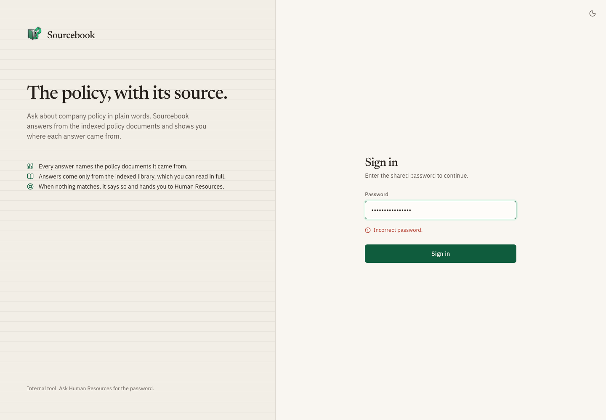
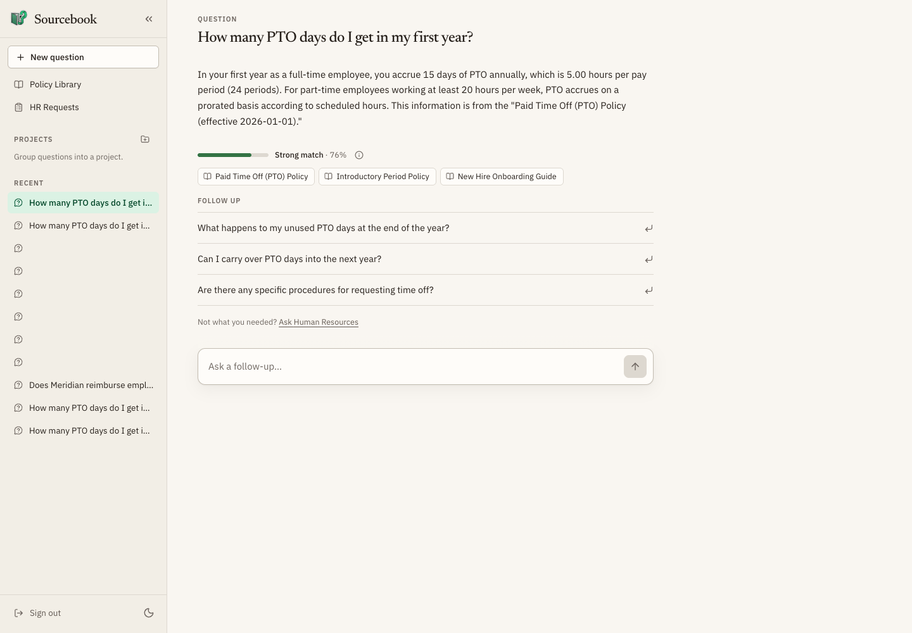
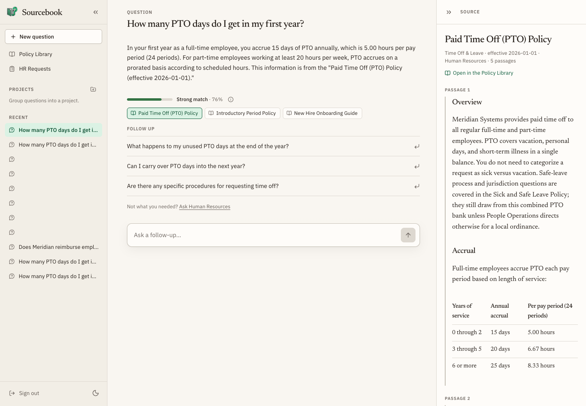
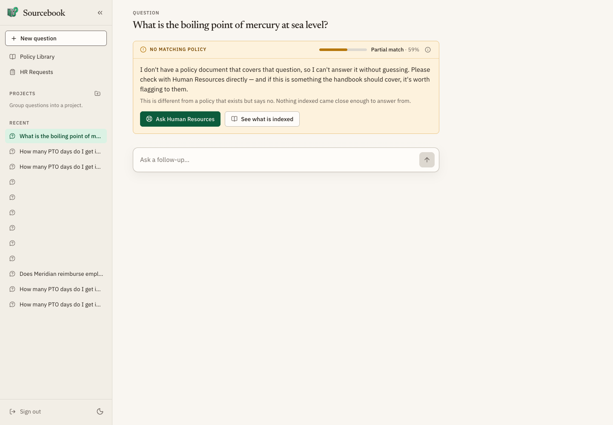
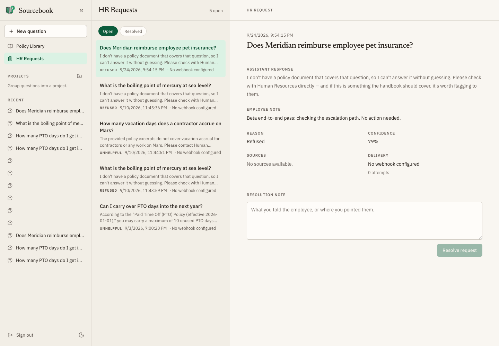
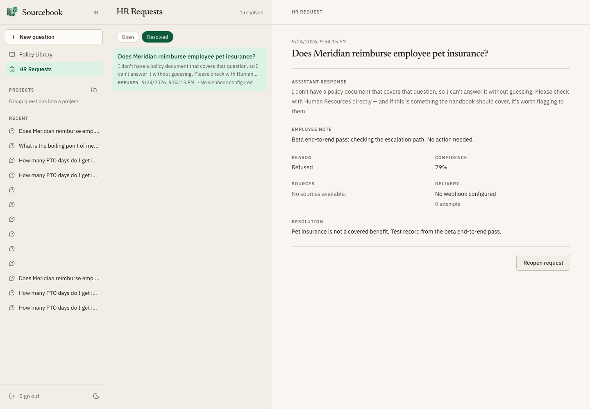

# User guide

How to use Sourcebook: asking a policy question, checking where the answer came
from, and handing a question to Human Resources when Sourcebook can't answer
it. The last part covers how Human Resources works those requests on the
**HR Requests** page.

To run your own copy, see [install.md](install.md). Scripts and integrations
use the HTTP API in [api.md](api.md).

The screenshots come from the recorded v0.2.0 beta pass on 2026-09-24, using the
fictional Meridian Systems sample policies. The untitled conversations in
their sidebar are leftover test sessions from that pass. Provenance is in
[releases/v0.2.0/evidence/](releases/v0.2.0/evidence/README.md).

## Sign in

Open the pilot at <https://sourcebook.duckdns.org>. If you're running it
locally with the stub, the address is <http://localhost:5173> and the password
is `dev`.

Sourcebook uses a shared password, not personal accounts. Ask Human
Resources for it, type it in **Password**, and select **Sign in**.

If sign-in fails, the message under the password box tells you why:

| Message | What to do |
| --- | --- |
| Incorrect password. | Check the password and try again. |
| Too many attempts. Wait a minute and try again. | Wait a minute. Repeated tries are limited. |
| Sign-in is unavailable right now. Try again in a moment. | The server isn't answering. Try again later, or tell whoever runs the site. |

## Ask a question

After you sign in you land on the question page, headed **What does the policy
say?** Type a question in plain words and press Enter, or pick one of the
examples under **Try one of these**. Shift+Enter starts a new line instead of
sending.

The answer appears as it's written. While it's being written, the box shows
**Answering…** and you can't send another question.

Under each answer you'll see:

- **A match meter**: **Strong match**, **Partial match**, or **Weak match**,
  with a percentage. It shows how closely the policy text Sourcebook found fits
  your question. It does *not* say whether the answer is correct. The info
  button beside it gives the same explanation. With a partial or weak match,
  read the source before relying on the answer.
- **Source buttons**: one for each policy document the answer drew from.
- **Follow up**: suggested next questions, under the latest answer only.
  Selecting one asks it right away. You can also type your own in **Ask a
  follow-up…**. Follow-ups use the earlier questions in the same conversation.

## Check a source

Select a source button under an answer. The **Source** pane opens beside the
answer on a wide screen, or over it on a narrow one, and shows the passages
Sourcebook used from that document. Select **Open in the Policy Library** to
read the whole document. Select the source button again, or the pane's
collapse or close button, to put it away.

If the pane says the document is no longer in the library index, it was
renamed or removed after the answer was written.

To browse every policy, select **Policy Library** in the sidebar. Search with
**Search by title…**, filter by category (select **All** to clear it), and
pick a policy to read it in full.

## When Sourcebook can't answer

Sourcebook won't guess. When the policies don't answer your question, you get
a card instead of an answer, with one of two headings:

- **No matching policy**: nothing indexed came close enough to answer from.
  The card still shows the match meter for the closest text it found.
- **Not answered by any policy**: some policies mention related topics, but
  none of them answers what you asked.

Neither one means the policy says no. It means the library doesn't cover the
question. The card offers **Ask Human Resources** and **See what is indexed**,
which opens the Policy Library.

## Ask Human Resources

You can hand a question to Human Resources in two places:

- On a refusal card, select **Ask Human Resources**.
- Under an answer that didn't help, select **Not what you needed? Ask Human
  Resources**.

Then:

1. In the **Send to Human Resources** box, optionally add a note, such as what
   your manager told you or why the answer didn't fit.
2. Select **Send**. Human Resources gets your question and the answer you were
   shown. You don't need to retype them.
3. The box is replaced by **Sent to Human Resources · ref** followed by a short
   reference code. Keep it in case you follow up with Human Resources directly.

Each answer can be sent only once. After that it shows the same reference.
Sourcebook doesn't show you when Human Resources resolves your request, so
expect them to reach you directly.

If sending fails, the box explains why and the button becomes **Try again**.
If it says the conversation is out of sync, reload the page and send again.

## Your conversations

Every question you ask starts or continues a conversation. Conversations are
kept on the server and listed in the sidebar under **Recent**, so they're
still there after a reload or on another device.

- **New question** starts a fresh conversation.
- Select a conversation to reopen it. Answers, sources, and follow-ups come
  back as they were.
- Hover over a conversation to rename or delete it. **Projects** in the
  sidebar group related conversations: create one with the **New project**
  button (the folder with a plus), then use a conversation's **Move to
  project** button to file it.

Everyone who can sign in, with either the team password or a reviewer
password, sees the same conversations and projects. Don't put anything in a
question that you wouldn't want colleagues to read.

## Sign out and sessions

Select **Sign out** at the bottom of the sidebar. Sign-in lasts 24 hours on
that browser. After that, Sourcebook returns you to the sign-in page the next
time you open it or ask something. Your conversations are unaffected.

The sidebar also has a light/dark theme switch. On a phone, open the sidebar
with the menu button at the top left. On a wide screen, you can collapse it to
a narrow strip of icons.

## If something goes wrong

| What you see | What it means |
| --- | --- |
| "The assistant is answering as many questions as it can right now…" with a **Retry in _N_s** button | Sourcebook is busy. When the countdown reaches zero, select **Retry** to ask again. If it's still busy after that, wait a moment and ask again. |
| "Sorry, something went wrong. Please try again." or "An error occurred while generating the response." | The answer didn't finish. Ask again, or start a **New question**. |
| "Could not load this source right now." in the Source pane | Close the pane and open the source again. |
| "Could not load the document library." | Reload the page. |
| You're suddenly back at the sign-in page | Your sign-in expired. Sign in again; your conversations are still there. |

## For Human Resources: the HR Requests page

Select **HR Requests** in the sidebar. Every escalated question lands here.
Anyone signed in can open this page; the pilot has no separate HR accounts.

On a wide screen the list sits on the left and the selected request on the
right. The newest request opens automatically. On a narrow screen you see the
list first; select a request to open it and **All requests** to go back.

- **Open** and **Resolved** switch between the two lists. The count beside
  **HR Requests** is the total for the list you're viewing.
- Each row shows the question, the start of the answer, whether it was
  **Refused** or marked **Unhelpful**, when it was sent, and its delivery
  status.
- The selected request shows the question, **Assistant response**,
  **Employee note**, **Reason**, **Confidence** (the match score the employee
  saw), **Sources**, and **Delivery**. A resolved request also shows its
  **Resolution**.

### Resolve or reopen a request

To resolve, type what you told the employee in **Resolution note** and select
**Resolve request**. The request moves to **Resolved** with your note.

To undo that, open the request under **Resolved** and select **Reopen
request**. It moves back to **Open**.

### Chat-channel delivery

Your team can also have new requests posted to a chat channel, such as Slack or
Teams. Whoever runs the site sets this up. **Delivery** on each request shows
where that stands:

| Delivery | Meaning |
| --- | --- |
| No webhook configured | No chat channel is set up. The request is only on this page. |
| Pending | Waiting to be posted, or being posted now. |
| Delivered | Posted to the chat channel. |
| Failed | Posting didn't work. |

When a post failed, or a request was never posted, a **Retry delivery** or
**Send to webhook** button appears. If the retry fails too, the page says
"Delivery was retried and failed again." After too many failed attempts the
button goes away and the page says the limit was reached.

### Empty lists and errors

- "No open requests…" means nothing is waiting for you.
- "Unable to load HR requests." Select **Try again**.
- "That request was not found." The link you followed points to a request that
  doesn't exist.

### Finding gaps in the policy library

The questions Sourcebook refuses most often are a good list of policies to
write next. Whoever runs the site can print that report on the server; see
[Learning from the query log](../README.md#learning-from-the-query-log) in the
README.
